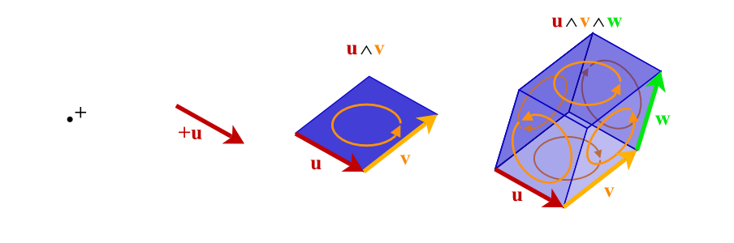

======================================
clifford: Geometric Algebra for Python
======================================

.. ipython::
    :doctest:

    In [138]: from clifford.g3 import *  # import GA for 3D space

    In [138]: import math

    In [138]: a = e1 + 2*e2 + 3*e3  # vector

    In [138]: R = math.e**(math.pi/4*e12)  # rotor

    @doctest
    In [138]: R*a*~R    # rotate the vector
    Out[138]: (2.0^e1) - (1.0^e2) + (3.0^e3)

This module implements Geometric Algebras (a.k.a. Clifford algebras).
Geometric Algebra (GA) is a universal algebra which subsumes complex algebra, quaternions, linear algebra and several other independent mathematical systems.
Scalars, vectors, and higher-grade entities can be mixed freely and consistently in the form of mixed-grade multivectors.

.. toctree::
    :maxdepth: 3
    :hidden:

    installation
    api/index
    predefined-algebras
    changelog
    issues

.. toctree::
    :maxdepth: 1
    :caption: Tutorials
    :hidden:

    tutorials/g2-quick-start
    tutorials/g3-algebra-of-space
    tutorials/euler-angles
    tutorials/space-time-algebra
    tutorials/InterfacingOtherMathSystems
    tutorials/PerformanceCliffordTutorial
    tutorials/cga/index
    tutorials/linear-transformations
    tutorials/apollonius-cga-augmented

.. toctree::
    :maxdepth: 1
    :caption: Other resources
    :hidden:

    resources
    bibliography
